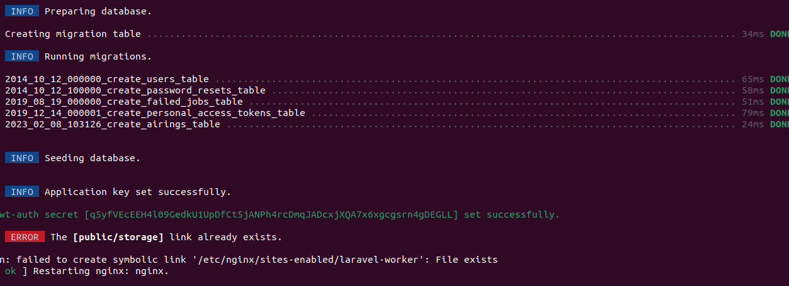

# Laporan Resmi Praktikum Jaringan Komputer - Modul 3 IT 20

Tugas: No
Videos: No

# Laporan Resmi Praktikum Jaringan Komputer - Modul 3 IT 20

> Annisa Rahmapuri - 5027211018
> 

> Abdul Zaki Syahrul Rahmat - 502721120
> 

## Soal 0-1

Setelah mengalahkan Demon King, perjalanan berlanjut. Kali ini, kalian diminta untuk melakukan register domain berupa **riegel.canyon.it20.com** untuk worker Laravel dan **granz.channel.it20.com** untuk worker PHP **(0)** mengarah pada worker yang memiliki IP [prefix IP].x.1. 

1. **Lakukan konfigurasi sesuai dengan peta yang sudah diberikan.**

### Cara Pengerjaan

- Membuat konfirgurasi network pada setiap node sesuai dengan kerangka Topologi
    
    
    
    | Node  | Kategori | Konfigurasi |
    | --- | --- | --- |
    | Aura | Router (DHCP Relay) | auto eth0
    iface eth0 inet dhcp
    
    auto eth1
    iface eth1 inet static
    	address 192.243.1.1
    	netmask 255.255.255.0
    
    auto eth2
    iface eth2 inet static
    	address 192.243.2.1
    	netmask 255.255.255.0
    
    auto eth3
    iface eth3 inet static
    	address 192.243.3.1
    	netmask 255.255.255.0
    
    auto eth4
    iface eth4 inet static
    	address 192.243.4.1
    	netmask 255.255.255.0 |
    | Himmel | DHCP Server | auto eth0
    iface eth0 inet static
    	address 192.243.1.2
    	netmask 255.255.255.0
    	gateway 192.243.1.1 |
    | Heiter | DNS Server | auto eth0
    iface eth0 inet static
    	address 192.243.1.3
    	netmask 255.255.255.0
    	gateway 192.243.1.1 |
    | Denken | Database Server | auto eth0
    iface eth0 inet static
    	address 192.243.2.2
    	netmask 255.255.255.0
    	gateway 192.243.2.1 |
    | Eisen | Load Balancer | auto eth0
    iface eth0 inet static
    	address 192.243.2.3
    	netmask 255.255.255.0
    	gateway 192.243.2.1 |
    | Frieren | Laravel Worker | auto eth0
    iface eth0 inet static
    	address 192.243.4.4
    	netmask 255.255.255.0
    	gateway 192.243.4.1 |
    | Flamme | Laravel Worker | auto eth0
    iface eth0 inet static
    	address 192.243.4.5
    	netmask 255.255.255.0
    	gateway 192.243.4.1 |
    | Fern | Laravel Worker | auto eth0
    iface eth0 inet static
    	address 192.243.4.6
    	netmask 255.255.255.0
    	gateway 192.243.4.1 |
    | Lawine | PHP Worker | auto eth0
    iface eth0 inet static
    	address 192.243.3.4
    	netmask 255.255.255.0
    	gateway 192.243.3.1 |
    | Linie | PHP Worker | auto eth0
    iface eth0 inet static
    	address 192.243.3.5
    	netmask 255.255.255.0
    	gateway 192.243.3.1 |
    | Lugner | PHP Worker | auto eth0
    iface eth0 inet static
    	address 192.243.3.6
    	netmask 255.255.255.0
    	gateway 192.243.3.1 |
    | Revolte | Client | auto eth0
    iface eth0 inet static
    	address 192.243.3.2
    	netmask 255.255.255.0
    	gateway 192.243.3.1 |
    | Richter | Client | auto eth0
    iface eth0 inet static
    	address 192.243.3.3
    	netmask 255.255.255.0
    	gateway 192.24.3.1 |
    | Sein | Client | auto eth0
    iface eth0 inet static
    	address 192.243.4.2
    	netmask 255.255.255.0
    	gateway 192.243.4.1 |
    | Stark | Client | auto eth0
    iface eth0 inet static
    	address 192.243.4.3
    	netmask 255.255.255.0
    	gateway 192.243.4.1 |
- Menjalankan command dibawah ini pada Router Aura
    
    ```bash
    iptables -t nat -A POSTROUTING -o eth0 -j MASQUERADE -s 192.243.0.0/16
    echo 'nameserver 192.168.122.1' > /etc/resolv.conf
    ```
    
- Menambahkan command dibawah ini pada seluruh node agar dapat terkoneksi internet
    
    ```bash
    echo 'nameserver 192.168.122.1' > /etc/resolv.conf
    ```
    
- Setelah berhasil untuk terhubung pada internet, buatlah register domain berupa `riegel.canyon.it20.com` untuk worker Laravel dan `granz.channel.it20.com` untuk worker PHP. Untuk worker laravel mengarah pada `Lunger` dan untuk worker PHP akan mengarah pada `Fern`. Berikut merupakan
    - Mengupdate paket dan menginstal bind9 pada sistem
        
        ```bash
        apt-get update 
        apt-get install bind9 -y
        ```
        
    - Menambahkan konfigurasi zona untuk domain **`riegel.canyon.it20.com`** dan **`granz.channel.it20.com`** dalam file **`/etc/bind/named.conf.local`**
        
        ```bash
        echo '
        zone "riegel.canyon.it20.com" {
                type master;
                file "/etc/bind/jarkom/riegel.canyon.it20.com";
        };
        
        zone "granz.channel.it20.com" {
                type master;
                file "/etc/bind/jarkom/granz.channel.it20.com";
        };
        
        ' > /etc/bind/named.conf.local
        ```
        
    - Membuat direktori **`/etc/bind/jarkom`**, menyalin file **`db.local`** sebagai dasar, dan membuat file konfigurasi zona untuk domain **`riegel.canyon.it20.com`** dan `granz.channel.it20.com` di dalamnya
        
        ```bash
        mkdir /etc/bind/jarkom
        cp /etc/bind/db.local /etc/bind/jarkom/riegel.canyon.it20.com
        
        echo '
        ;
        ; BIND data file for local loopback interface
        ;
        $TTL    604800
        @       IN      SOA     riegel.canyon.it20.com. root.riegel.canyon.it20.com. (
                                2023101001      ; Serial
                                 604800         ; Refresh
                                  86400         ; Retry
                                2419200         ; Expire
                                 604800 )       ; Negative Cache TTL
        ;
        @       IN      NS      riegel.canyon.it20.com.
        @       IN      A       192.243.3.6     ; IP Lugner
        www     IN      CNAME   riegel.canyon.it20.com.' > /etc/bind/jarkom/riegel.canyon.it20.com
        
        cp /etc/bind/db.local /etc/bind/jarkom/granz.channel.it20.com
        
        echo '
        ; BIND data file for local loopback interface
        ;
        $TTL    604800
        @       IN      SOA     granz.channel.it20.com. root.granz.channel.it20.com. (
                                2023101001      ; Serial
                                 604800         ; Refresh
                                  86400         ; Retry
                                2419200         ; Expire
                                 604800 )       ; Negative Cache TTL
        ;
        @       IN      NS      granz.channel.it20.com.
        @       IN      A       192.243.3.6  ; IP Fern
        www     IN      CNAME   granz.channel.it20.com.' > /etc/bind/jarkom/granz.channel.it20.com
        ```
        
    - Restart bind9
        
        ```bash
        service bind9 restart
        ```
        

### Testing


## Soal 2-5

Kemudian, karena masih banyak spell yang harus dikumpulkan, bantulah para petualang untuk memenuhi kriteria berikut.:

1. Semua **CLIENT** harus menggunakan konfigurasi dari DHCP Server.
2. Client yang melalui Switch3 mendapatkan range IP dari [prefix IP].3.16 - [prefix IP].3.32 dan [prefix IP].3.64 - [prefix IP].3.80 **(2)**
3. Client yang melalui Switch4 mendapatkan range IP dari [prefix IP].4.12 - [prefix IP].4.20 dan [prefix IP].4.160 - [prefix IP].4.168 **(3)**
4. Client mendapatkan DNS dari Heiter dan dapat terhubung dengan internet melalui DNS tersebut **(4)**
5. Lama waktu DHCP server meminjamkan alamat IP kepada Client yang melalui Switch3 selama 3 menit sedangkan pada client yang melalui Switch4 selama 12 menit. Dengan waktu maksimal dialokasikan untuk peminjaman alamat IP selama 96 menit **(5)** 

### Cara Pengerjaan

- **DHCP Server (Himmel)**
    - Mengupdate paket, menginstal ISC DHCP Server, dan mengecek versi DHCP server yang telah diinstal.
        
        ```bash
        echo 'nameserver 192.168.122.1' > /etc/resolv.conf
        
        apt-get update
        apt-get install isc-dhcp-server
        dhcpd --version
        ```
        
    - Membuat konfigurasi subnet dan rentang alamat IP untuk klien di masing-masing subnet, yaitu pada `Switch3` pada range '192.243.3.16' - '192.243.3.32',  '192.243.3.64' - '192.243.3.80' dan `Switc4` pada range '192.243.4.12' - '192.243.4.20' dan '192.243.4.160' -'192.243.4.168' sesuai dengan peritah soal. Kami juga menetapkan default-lease-time untuk `Switch3` selama 3 menit sedangkan pada client yang melalui `Switch4` selama 12 menit dan max-lease-time selama 96 menit, sesuai dengan perintah soal.
        
        ```bash
        echo '
        subnet '192.243.1.0' netmask '255.255.255.0' {
           
        }
        
        subnet '192.243.2.0' netmask '255.255.255.0' {
            
        }
        
        subnet '192.243.3.0' netmask '255.255.255.0' {
            range '192.243.3.16' '192.243.3.32';
            range '192.243.3.64' '192.243.3.80';
            option routers '192.243.3.1';
            option domain-name-servers '192.243.1.3';
            default-lease-time '180';
            max-lease-time '5760';
        }
        
        subnet '192.243.4.0' netmask '255.255.255.0' {
            range '192.243.4.12' '192.243.4.20';
            range '192.243.4.160' '192.243.4.168';
            option routers '192.243.4.1';
            option domain-name-servers '192.243.1.3';
            default-lease-time '720';
            max-lease-time '5760';
        }
        ' > /etc/dhcp/dhcpd.conf
        ```
        
    - Restart dan cek status bind9
        
        ```bash
        service isc-dhcp-server restart
        service isc-dhcp-server status
        ```
        
- **DHCP Relay (Aura)**
    - Mengupdate paket, menginstal ISC DHCP Relay, dan memulai layanan DHCP relay
        
        ```bash
        apt-get update
        apt-get install isc-dhcp-relay -y
        service isc-dhcp-relay start
        ```
        
    - Menetapkan konfigurasi DHCP relay dengan menentukan alamat IP DHCP server (Himmel) pada `SERVERS` dan antarmuka yang digunakan oleh relay pada `INTERFACES`, sesuai dengan topologi yang dibuat.
        
        ```bash
        echo '
        SERVERS="192.243.1.2"
        INTERFACES="eth1 eth2 eth3 eth4"
        OPTIONS=' > /etc/default/isc-dhcp-relay
        ```
        
    - Mengaktifkan IP forwarding pada router. Hal ini memungkinkan router untuk meneruskan paket antara antarmuka yang berbeda.
        
        ```bash
        echo 'net.ipv4.ip_forward=1' > /etc/sysctl.conf
        ```
        
    - Restart DHCP Relay
        
        ```bash
        service isc-dhcp-relay restart
        ```
        

### Testing


## Soal 6

Pada masing-masing worker PHP, lakukan konfigurasi virtual host untuk website [berikut](https://drive.google.com/file/d/1ViSkRq7SmwZgdK64eRbr5Fm1EGCTPrU1/view?usp=sharing) dengan menggunakan php 7.3. **(6)**

### Cara Pengerjaan

- Melakukan instalasi dan konfigurasi awal untuk masing masing PHP worker.  Nginx dan PHP-FPM diaktifkan untuk menghosting aplikasi PHP.
    
    ```bash
    # Installasi paket-paket yang diperlukan
    apt-get update
    apt-get install nginx -y
    apt-get install wget unzip -y
    apt-get install lynx -y
    apt-get install htop -y
    apt-get install apache2-utils -y
    apt-get install php php-fpm -y
    
    # Start layanan Nginx dan PHP-FPM
    service nginx start
    service nginx 
    service php7.3-fpm start
    ```
    
- Download dan menyiapkan aplikasi PHP yang akan dihost pada worker.
    
    ```bash
    # Unduh dan ekstrak aplikasi PHP dari Google Drive
    wget -O '/var/www/granz.channel.it20.com.zip' 'https://drive.google.com/u/0/uc?id=1ViSkRq7SmwZgdK64eRbr5Fm1EGCTPrU1&export=download'
    unzip -o /var/www/granz.channel.it20.com.zip -d /var/www/
    rm /var/www/granz.channel.it20.com
    mv /var/www/modul-3 /var/www/granz.channel.it20.com
    ```
    
- Copy konfigurasi default Nginx, kemudian mengonfigurasi Nginx untuk menghosting aplikasi PHP di direktori **`/var/www/granz.channel.it20.com`**. Konfigurasi ini mencakup penanganan file PHP dan pengaturan fastcgi untuk PHP-FPM.
    
    ```bash
    # Salin konfigurasi default Nginx dan atur konfigurasi untuk aplikasi PHP
    cp /etc/nginx/sites-available/default /etc/nginx/sites-available/granz.channel.it20.com
    ln -s /etc/nginx/sites-available/granz.channel.it20.com /etc/nginx/sites-enabled/
    rm /etc/nginx/sites-enabled/default
    
    # Konfigurasi Nginx untuk aplikasi PHP
    echo '
    server {
        listen 80;
        server_name _;
    
        root /var/www/granz.channel.it20.com;
        index index.php index.html index.htm;
    
        location / {
            try_files $uri $uri/ /index.php?$query_string;
        }
    
        location ~ \.php$ {
            include snippets/fastcgi-php.conf;
            fastcgi_pass unix:/run/php/php7.3-fpm.sock;  # Sesuaikan versi PHP dan socket
            fastcgi_param SCRIPT_FILENAME $document_root$fastcgi_script_name;
            include fastcgi_params;
        }
    }' > /etc/nginx/sites-available/granz.channel.it20.com
    ```
    
- Restart Nginx
    
    ```bash
    # Restart layanan Nginx
    service nginx restart
    ```
    

### Testing

Dilakukan pada masing-masing PHP worker, yaitu Linie, Lawine, dan Lugner. Outputnya akan seperti berikut : 


## Soal 7

Kepala suku dari [Bredt Region](https://frieren.fandom.com/wiki/Bredt_Region) memberikan resource server sebagai berikut :

1. Lawine, 4GB, 2vCPU, dan 80 GB SSD.
2. Linie, 2GB, 2vCPU, dan 50 GB SSD.
3. Lugner 1GB, 1vCPU, dan 25 GB SSD.

aturlah agar Eisen dapat bekerja dengan maksimal, lalu lakukan testing dengan 1000 request dan 100 request/second.

### Cara Pengerjaan

- **DNS Server (Himmel)**
    - Modifikasi konfigurasi DNS Server agar domainnya mengarah pada Load Balancer (Eisien)
        
        ```bash
        echo '
        ;
        ; BIND data file for local loopback interface
        ;
        $TTL    604800
        @       IN      SOA     riegel.canyon.it20.com. root.riegel.canyon.it20.com. (
                                2023101001      ; Serial
                                 604800         ; Refresh
                                  86400         ; Retry
                                2419200         ; Expire
                                 604800 )       ; Negative Cache TTL
        ;
        @       IN      NS      riegel.canyon.it20.com.
        @       IN      A       192.243.2.3     ; IP Eisien
        www     IN      CNAME   riegel.canyon.it20.com.' > /etc/bind/jarkom/riegel.canyon.it20.com
        
        echo '
        ; BIND data file for local loopback interface
        ;
        $TTL    604800
        @       IN      SOA     granz.channel.it20.com. root.granz.channel.it20.com. (
                                2023101001      ; Serial
                                 604800         ; Refresh
                                  86400         ; Retry
                                2419200         ; Expire
                                 604800 )       ; Negative Cache TTL
        ;
        @       IN      NS      granz.channel.it20.com.
        @       IN      A       192.243.2.3  ; IP Eisien
        www     IN      CNAME   granz.channel.it20.com.' > /etc/bind/jarkom/granz.channel.it20.com
        ```
        
- **Load Balancer (Eisien)**
    - Mengonfigurasi nameserver pada file **`/etc/resolv.conf`** dan menginstal selutuh kebutuhan yang diinginkan.
        
        ```bash
        # Konfigurasi nameserver pada resolv.conf
        echo '
        nameserver 192.243.1.3 # IP DNS Server
        nameserver 192.168.122.1' > /etc/resolv.conf
        
        # Install dan start Nginx
        apt-get update 
        apt-get install nginx -y
        service nginx start
        service nginx status
        
        apt-get install php php-fpm -y
        apt install apache2-utils -y
        ```
        
    - Membuat konfigurasi Load Balancer di Nginx dengan upstream server yang terdiri dari tiga alamat IP Worker (192.243.3.4, 192.243.3.5, 192.243.3.6). Setiap permintaan ke Load Balancer akan dialihkan ke salah satu dari worker tersebut
        
        ```bash
        # Salin konfigurasi default Nginx ke konfigurasi Load Balancer
        cp /etc/nginx/sites-available/default /etc/nginx/sites-available/lb_php
        
        # Konfigurasi Load Balancer pada lb_php
        echo ' upstream worker {
            server 192.243.3.4;
            server 192.243.3.5;
            server 192.243.3.6;
        }
        
        server {
            listen 80;
            server_name granz.channel.it20.com www.granz.channel.it20.com;
        
            root /var/www/html;
        
            index index.html index.htm index.nginx-debian.html;
        
            server_name _;
            
             location / {
                proxy_pass http://worker;
            }
        } ' > /etc/nginx/sites-available/lb_php
        ```
        
    - Mengaktifkan konfigurasi Load Balancer, menghapus konfigurasi default yang tidak dibutuhkan, dan merestart layanan Nginx untuk menerapkan perubahan
        
        ```bash
        # Aktifkan konfigurasi Load Balancer
        ln -s /etc/nginx/sites-available/lb_php /etc/nginx/sites-enabled/
        
        # Hapus konfigurasi default yang tidak dibutuhkan
        rm /etc/nginx/sites-enabled/default
        
        # Restart layanan Nginx untuk menerapkan perubahan
        service nginx restart
        ```
        

### Testing

Menjalankan testing 1000 request dan 100 request/second dengan command sebagai berikut : 

```bash
ab -n 1000 -c 100 http://www.granz.channel.it20.com/
```


> Dapat dilihat, request tersebut menghasilkan `Requests per second: 1387 [#/sec] (mean)`
> 

## Soal 8

Karena diminta untuk menuliskan grimoire, buatlah analisis hasil testing dengan 200 request dan 10 request/second masing-masing algoritma Load Balancer dengan ketentuan sebagai berikut:

1. Nama Algoritma Load Balancer
2. Report hasil testing pada Apache Benchmark
3. Grafik request per second untuk masing masing algoritma.
4. Analisis

### Testing

Menjalankan testing dengan 200 request dan 10 request/second dengan masing-masing algoritma Load Balancer. 

```bash
ab -n 200 -c 10 http://www.granz.channel.it20.com/
```

- **Round Robbin**
- **Least-connection**
- **IP Hash**
- **Generic Hash**

Berdasarkan testing menggunakan masing masing Algoritma Load Balancer, dapat disimpulkan dalam grafik di bawah ini : 

 

## Soal 9

Dengan menggunakan algoritma Round Robin, lakukan testing dengan menggunakan 3 worker, 2 worker, dan 1 worker sebanyak 100 request dengan 10 request/second, kemudian tambahkan grafiknya pada grimoire. 

### Testing

Menjalankan testing dengan menggunakan 3 worker, 2 worker, dan 1 worker sebanyak 100 request dengan 10 request/second. 

```bash
ab -n 100 -c 10 http://www.granz.channel.it20.com/
```

Berdasarkan testing  menggunakan 3 worker, 2 worker, dan 1 worker, dapat disimpulkan dalam grafik di bawah ini : 

## Soal 10

Selanjutnya coba tambahkan konfigurasi autentikasi di LB dengan dengan kombinasi username: “netics” dan password: “ajkit20”, dengan yyy merupakan kode kelompok. Terakhir simpan file “htpasswd” nya di /etc/nginx/rahasisakita/ 

### Cara Pengerjaan

- Pada Load Balancer (Eisien), tambahkan konfigurasi autentikasi di Load Balancer dan menyimpan file htpasswd, Anda dapat menggunakan perintah **`htpasswd`** yang sudah disediakan oleh Apache Utilities.
    
    ```bash
    # Buat direktori untuk menyimpan file htpasswd
    mkdir -p /etc/nginx/rahasisakita
    
    # Buat file htpasswd dengan kombinasi username dan password
    htpasswd -c /etc/nginx/rahasisakita/htpasswd netics
    ```
    
- Tambahkan blok **`auth_basic`** dan **`auth_basic_user_file`** dalam blok **`location /`**
    
    ```bash
    server {
        listen 80;
        server_name granz.channel.it20.com www.granz.channel.it20.com;
    
        root /var/www/html;
    
        index index.html index.htm index.nginx-debian.html;
    
        server_name _;
        
        location / {
            auth_basic "Restricted Content";
            auth_basic_user_file /etc/nginx/rahasisakita/htpasswd;
    
        }
    } ' > /etc/nginx/sites-available/lb_php
    ```
    
- Restart Nginx
    
    ```bash
    service nginx restart
    ```
    

### Testing


Akan ada Alert berupa `Acces without authorization denied` dan diharuskan untuk memasukan username dan password agar dapat mengakses  `www.granz.channel.it20.com`


## Soal 11

Lalu buat untuk setiap request yang mengandung /its akan di proxy passing menuju halaman [https://www.its.ac.id](https://www.its.ac.id/).  **hint: (proxy_pass)**

### Cara Pengerjaan

- Menambahkan konfigurasi tambahan di Load Balancer (Eisien)
    
    ```bash
    location ~ /its {
        proxy_pass https://www.its.ac.id;
        proxy_set_header Host www.its.ac.id;
        proxy_set_header X-Real-IP $remote_addr;
        proxy_set_header X-Forwarded-For $proxy_add_x_forwarded_for;
        proxy_set_header X-Forwarded-Proto $scheme;
    }
    ```
    

### Testing

Kita coba untuk mengakses pada endpoint yang mengandung `/its` yang nantinya akan akan diarahkan oleh `proxy_pass` menuju `https://www.its.ac.id` dengan command sebagai berikut : 

```bash
lynx www.granz.channel.it20.com/its
```


## Soal 12

Selanjutnya LB ini hanya boleh diakses oleh client dengan IP [Prefix IP].3.69, [Prefix IP].3.70, [Prefix IP].4.167, dan [Prefix IP].4.168. 

### Cara Pengerjaan

- Menambahkan konfigurasi tambahan di Load Balancer (Eisien)
    
    ```bash
    location / {
        allow 192.173.3.69;
        allow 192.173.3.70;
        allow 192.173.4.167;
        allow 192.173.4.168;
        deny all;
        proxy_pass http://worker;
    }
    ```
    

### Testing


## Soal 13

#### Karena para petualang kehabisan uang, mereka kembali bekerja untuk mengatur riegel.canyon.yyy.com.

Semua data yang diperlukan, diatur pada Denken dan harus dapat diakses oleh Frieren, Flamme, dan Fern.

Pada soal nomor 13 ini kita perlu untuk mensetup Database Server (Node Denken) yang kemudian database tersebut perlu dapat diakses di node Frieren, Flamme, dan Fern.

### 1. Menyambungkan Node Denken sudah tersambung ke DNS Server

Langkah yang paling awal setelah kita menjalankan Node Denken adalah kita perlu menyambungkan nya dengan DNS Server. Tambahkan IP Heiter di resolv.conf Denken

```bash
echo 'nameserver 192.243.1.2' > etc/resolv.conf
```
### 2. Installasi package MariaDB
Di soal ini kita memerlukan service mariadb-server karena node ini akan digunakan sebagai database server. Install package mariadb-server, jangan lupa untuk lakukan update terlebih dahulu

```bash
apt-get update
apt-get install mariadb-server -y
service mysql start
```
Jalankan service mysql dengan script berikut
```bash
service mysql start
```
 
### 3. Masuk ke dalam service mySQL
Sebelum memasukkan command sql kita perlu terlebih dahulu login ke dalam mysql, eksekusi command berikut ini
```bash
mysql -u root -p
```
Untuk password defaultnya adalah : **root**     

Disini kita sudah berhasil untuk login sebagai user root pada service mysql

### 4. Lakukan Konfigurasi mySQL
Konfigurasikan mySQL untuk aplikasi Laravel yang akan digunakan dengan mengeksekusi query berikut
```sql
CREATE USER 'kelompokit20'@'%' IDENTIFIED BY 'passwordit20';
CREATE USER 'kelompokit20'@'localhost' IDENTIFIED BY 'passwordit20';
CREATE DATABASE dbkelompokit20;
GRANT ALL PRIVILEGES ON *.* TO 'kelompokit20'@'%';
GRANT ALL PRIVILEGES ON *.* TO 'kelompokit20'@'localhost';
FLUSH PRIVILEGES;
```

### 5. Lakukan Konfigurasi untuk koneksi ke Worker
Karena database perlu dapat diakses oleh Laravel Worker, ubah script pada ```/etc/mysql/my.cnf```
```bash
[mysqld]
skip-networking=0
skip-bind-address
```
Dan juga pada file ```/etc/mysql/mariadb.conf.d/50-server.cnf```
```bash
bind-address            = 0.0.0.0
```
Jangan lupa untuk merestart service mySQL
```bash
service restart mysql
```
### 6. Lakukan Testing pada Worker
Setelah semua konfigurasi selesai, kita dapat melakukan testing pada salah satu worker, disini kami menggunakan Worker Fern yang memiliki IP Address **192.243.4.1** dengan menginstallasi package mariadb-client dan menggunakan command berikut
```bash
apt-get install mariadb-client -y
```
```bash
mariadb --host=192.243.2.1 --port=3306 --user=kelompokit20 --password=passwordit20 dbkelompokit20
```
Hasilnya adalah Worker Fern berhasil mengakses Database


## Soal 14
Frieren, Flamme, dan Fern memiliki Riegel Channel sesuai dengan quest guide berikut. Jangan lupa melakukan instalasi PHP8.0 dan Composer

Di nomor 14 ini kita akan melakukan installasi aplikasi Laravel pada ketiga worker Laravel. Aplikasikan langkah-langkah dibawah ini di ketiga worker.

### 1. Koneksi ke DNS Server
Tambahkan IP Heiter di resolv.conf Denken

```bash
echo 'nameserver 192.243.1.2' > etc/resolv.conf
```
### 2. Installasi Package yang diperlukan
Ada beberapa package yang diperlukan untuk mengerjakan nomor 14 ini. Berikut adalah script untuk menginstall dan menjalankan package-package tersebut
```bash
apt-get update

# Lynx, Engine X
apt-get install lynx -y
apt-get install nginx -y

# PHP 8.0
apt-get install -y lsb-release ca-certificates apt-transport-https software-properties-common gnupg2
curl -sSLo /usr/share/keyrings/deb.sury.org-php.gpg https://packages.sury.org/php/apt.gpg
sh -c 'echo "deb [signed-by=/usr/share/keyrings/deb.sury.org-php.gpg] https://packages.sury.org/php/ $(lsb_release -sc) main" > /etc/apt/sources.list.d/php.list'

apt-get update
apt-get install php8.0-mbstring php8.0-xml php8.0-cli php8.0-common php8.0-intl php8.0-opcache php8.0-readline php8.0-mysql php8.0-fpm php8.0-curl unzip wget -y
php --version

service nginx start
service php8.0-fpm start

# Composer
wget https://getcomposer.org/download/2.0.13/composer.phar
chmod +x composer.phar
mv composer.phar /usr/bin/composer
composer -V

# Git
apt-get install git -y
```
### 3. Cloning aplikasi Laravel
Selanjutnya kita akan melakukan *git clone* pada aplikasi Laravel yang akan kita gunakan. 
```bash
git clone https://github.com/martuafernando/laravel-praktikum-jarkom.git
```
Pindahkan hasil clone tersebut kedalam folder ```/var/www/laravel-praktikum-jarkom```
```bash
mv laravel-praktikum-jarkom /var/www/laravel-praktikum-jarkom
```

### 4. Konfigurasi aplikasi Laravel
Sebelum mulai melakukan konfigurasi, kita terlebih dahulu perlu menginstall modul yang ada pada aplikasi Laravel kita menggunakan composer
```bash
cd /var/www/laravel-praktikum-jarkom
composer update
composer install
```


Setelah itu, rename file ```.env.example``` menjadi ```.env```, dan lakukan konfigurasi sebagai berikut
```bash
DB_CONNECTION=mysql
DB_HOST=192.243.2.1
DB_PORT=3306
DB_DATABASE=dbkelompokit20
DB_USERNAME=kelompokit20
DB_PASSWORD=passwordit20
```

Konfigurasi tersebut akan menghubungkan aplikasi dengan database yang sudah dibuat sebelumnya. Setelah itu, eksekusi command Laravel berikut
```bash
php artisan migrate:fresh
php artisan db:seed --class=AiringsTableSeeder
php artisan key:generate
php artisan jwt:secret
php artisan storage:link
```


Kita juga perlu melakukan konfigurasi nginx, lakukan konfigurasi seperti dibawah ini pada file ```/etc/nginx/sites-available/laravel-worker```
```nginx
server {

    listen 8001; # Ubah sesuai worker

    root /var/www/laravel-praktikum-jarkom/public;

    index index.php index.html index.htm;
    server_name _;

    location / {
            try_files $uri $uri/ /index.php?$query_string;
    }

    # pass PHP scripts to FastCGI server
    location ~ \.php$ {
    include snippets/fastcgi-php.conf;
    fastcgi_pass unix:/var/run/php/php8.0-fpm.sock;
    }

location ~ /\.ht {
            deny all;
    }

    error_log /var/log/nginx/laravel-worker_error.log;
    access_log /var/log/nginx/laravel-worker_access.log;
}
```
Kemudian lakukan symlink dan kelola akses izin
```bash
ln -s /etc/nginx/sites-available/laravel-worker /etc/nginx/sites-enabled/
chown -R www-data.www-data /var/www/laravel-praktikum-jarkom/
```
Jangan lupa untuk melakukan restart pada nginx dan PHP 8.0
```bash
service nginx restart
service php8.0-fpm start
```
### 5. Testing aplikasi
Untuk melakukan testing kita dapat menggunakan **lynx localhost:[port]** sesuai dengan Worker yang kita gunakan. Disini kami akan melakukan testing pada worker Fern dengan port 8001
```bash
lynx localhost:8001
```
Jika sudah berhasil, akan tampil tampilan berikut

## Soal 15 - 17
Pada 3 soal ini kita akan melakukan benchmarking pada client untuk aplikasi Laravel yang sudah kita buat sebelumnya

Riegel Channel memiliki beberapa endpoint yang harus ditesting sebanyak 100 request dengan 10 request/second. Tambahkan response dan hasil testing pada grimoire. 

Sebelum melakukan testing, pastikan client sudah terhubung ke DNS Server
```bash
echo 'nameserver 192.243.1.2' > etc/resolv.conf
```
Lakukan installasi juga untuk package yang diperlukan untuk benchmarking seperti Apache Benchmark dan Htop
```bash
apt-get update
apt-get install lynx -y
apt-get install htop -y
apt-get install apache2-utils -y
apt-get install jq -y
```
Untuk testing, kami disini menggunakan client Stark dan worker Fern
### 15. POST /auth/register
Pada nomor 15 kami membuat file JSON yang berisi kredensial username dan password untuk benchmarking ini yang diberi nama ```credentials.json```
```json
{
  "username": "kelompokit20",
  "password": "passwordit20"
}
```
Untuk testingnya menggunakan command berikut
```bash
ab -n 100 -c 10 -p credentials.json -T application/json http://192.243.4.1:8001/api/auth/register
```


### 16. POST /auth/login
Nomor ini juga menggunakan ```credentials.json``` yang dibuat sebelumnya, hanya endpoint api nya saja yang dirubah
```bash
ab -n 100 -c 10 -p credentials.json -T application/json http://192.243.4.1:8001/api/auth/login
```

### 17. GET /me
Untuk endpoint ini kita perlu untuk menggunakan bearer token, yang didapat dengan melakukan request POST ke endpoint di nomor sebelumnya
```bash
curl -X POST -H "Content-Type: application/json" -d @credentials.json http://192.243.4.1:8001/api/auth/login > output.txt
```

Response dari request tersebut akan disimpan di output.txt, jika berhasil maka akan tampil token yang akan kita gunakan. Perlu diperhatikan jika terjadi kegagalan ada kemungkinan server menerima terlalu banyak request sehingga kita perlu tunggu dulu beberapa saat.

Selanjutnya, masukkan token ke variabel global dengan jq
```bash
token=$(cat output.txt | jq -r '.token')
```
Kemudian jalankan command testing dibawah ini
```bash
ab -n 100 -c 10 -H "Authorization: Bearer $token" http://192.243.4.1:8001/api/me
```

## Soal 18
Untuk memastikan ketiganya bekerja sama secara adil untuk mengatur Riegel Channel maka implementasikan Proxy Bind pada Eisen untuk mengaitkan IP dari Frieren, Flamme, dan Fern.

Untuk mengimplementasikan proxy bind pada node Load Balancer (Eisen), kita dapat melakukan langkah-langkah berikut

### 1. Koneksi ke DNS Server
Tambahkan IP Heiter di resolv.conf Eisen

```bash
echo 'nameserver 192.243.1.2' > etc/resolv.conf
```
### 2. Konfigurasi ulang Bind di Heiter
Subdomain *riegel.canyon.it20.com* perlu diarahkan ke IP Address Load Balancer (Eisen), sehingga kita perlu melakukan konfigurasi ulang pada file ```/etc/bind/jarkom/riegel.canyon.it20.com``` di DNS Server (Heiter)
```bind
;
; BIND data file for local loopback interface
;
$TTL    604800
@       IN      SOA     riegel.canyon.it20.com. root.riegel.canyon.it20.com. (
                        2023101001      ; Serial
                         604800         ; Refresh
                          86400         ; Retry
                        2419200         ; Expire
                         604800 )       ; Negative Cache TTL
;
@       IN      NS      riegel.canyon.it20.com.
@       IN      A       192.243.2.1     ; IP Eisen (Load Balancer)
www     IN      CNAME   riegel.canyon.it20.com.
```

### 3. Konfigurasi Nginx di Load Balancer
Jangan lupa untuk melakukan installasi package nginx terlebih dahulu
```bash
apt-get update
apt-get install nginx
```
Setelah nginx terinstall, lakukan konfigurasi pada file ```/etc/nginx/sites-available/laravel-worker```

```nginx
upstream worker {
    server 192.243.4.1:8001;
    server 192.243.4.2:8002;
    server 192.243.4.3:8003;
}
server {
    listen 80;
    server_name riegel.canyon.it20.com www.riegel.canyon.it20.com;

    location / {
        proxy_pass http://worker;
    }
}
```
Seperti biasa, setelah itu kita akan lakukan symlink kemudian me-restart nginx

```bash
ln -s /etc/nginx/sites-available/laravel-worker /etc/nginx/sites-enabled/laravel-worker

service nginx restart
```

### 4. Testing
Untuk melakukan testing kita dapat mengeksekusi command berikut
```bash
ab -n 100 -c 10 -p credentials.json -T application/json http://riegel.canyon.it20.com/api/auth/login
```
Bisa dilihat kembali untuk command testing nya tidak lagi menggunakan **ip:port** melainkan **subdomain** yang sudah diarahkan ke Load Balancer

## Soal 19
Untuk meningkatkan performa dari Worker, coba implementasikan PHP-FPM pada Frieren, Flamme, dan Fern. Untuk testing kinerja naikkan 
- pm.max_children
- pm.start_servers
- pm.min_spare_servers
- pm.max_spare_servers
sebanyak tiga percobaan dan lakukan testing sebanyak 100 request dengan 10 request/second kemudian berikan hasil analisisnya pada Grimoire.

Pada soal 19 ini kita akan melakukan modifikasi pada parameter-parameter PHP-FPM yang berada di worker. Parameter-parameter tersebut dapat ditemukan di file ```/etc/php/8.0/fpm/pool.d/www.conf```, berikut adalah script dan parameter yang kami gunakan

- ### Script 1
```conf
[www]
user = www-data
group = www-data
listen = /run/php/php8.0-fpm.sock
listen.owner = www-data
listen.group = www-data
php_admin_value[disable_functions] = exec,passthru,shell_exec,system
php_admin_flag[allow_url_fopen] = off

; Choose how the process manager will control the number of child processes.

pm = dynamic
pm.max_children = 3
pm.start_servers = 1
pm.min_spare_servers = 1
pm.max_spare_servers = 3
```
- ### Script 2
```conf
[www]
user = www-data
group = www-data
listen = /run/php/php8.0-fpm.sock
listen.owner = www-data
listen.group = www-data
php_admin_value[disable_functions] = exec,passthru,shell_exec,system
php_admin_flag[allow_url_fopen] = off

; Choose how the process manager will control the number of child processes.

pm = dynamic
pm.max_children = 15
pm.start_servers = 3
pm.min_spare_servers = 3
pm.max_spare_servers = 5
```
- ### Script 3
```conf
[www]
user = www-data
group = www-data
listen = /run/php/php8.0-fpm.sock
listen.owner = www-data
listen.group = www-data
php_admin_value[disable_functions] = exec,passthru,shell_exec,system
php_admin_flag[allow_url_fopen] = off

; Choose how the process manager will control the number of child processes.

pm = dynamic```
pm.max_children = 25
pm.start_servers = 5
pm.min_spare_servers = 5
pm.max_spare_servers = 10
```pada
service php8.0-fpm restart
```
Untuk command testing nya masih sama dengan nomor sebelumnya
```bash
ab -n 100 -c 10 -p credentials.json -T application/json http://riegel.canyon.it20.com/api/auth/login
```

## Soal 20
Nampaknya hanya menggunakan PHP-FPM tidak cukup untuk meningkatkan performa dari worker maka implementasikan Least-Conn pada Eisen. Untuk testing kinerja dari worker tersebut dilakukan sebanyak 100 request dengan 10 request/second.

Untuk mengubah algoritma yang digunakan oleh Load Balancer kita perlu melakukan konfigurasi ulang nginx di Eisen. Lebih tepatnya di file ```/etc/nginx/sites-available/laravel-worker``` yang sudah kita buat sebelumnya

```nginx
upstream worker {
    least_conn; # Least Connection
    # least_time; # Least Time
    # ip_hash; # IP Hash
    server 192.243.4.1:8001;
    server 192.243.4.2:8002;
    server 192.243.4.3:8003;
}

server {
    listen 80;
    server_name riegel.canyon.it20.com www.riegel.canyon.it20.com;

    location / {
        proxy_pass http://worker;
    }
}
```
Save kemudian restart nginx dan lakukan testing menggunakan command sebelum-sebelumnya
```bash
service nginx restart
ab -n 100 -c 10 -p credentials.json -T application/json http://riegel.canyon.it20.com/api/auth/login
```


Default .bashrc (buat semua)

bash /root/setup.sh

bash /root/config.sh

IP Address
Heiter (DNS Server) - 192.243.1.2
Eisen (Load Balancer) - 192.243.2.2
Himmel (DHCP Server) - 192.243.1.1
Denken (Database Server) - 192.243.2.1

Frieren (Laravel Worker) - 192.243.4.3
Flamme (Laravel Worker) - 192.243.4.2
Fern (Laravel Worker) - 192.243.4.1

Lawine (PHP Worker) - 192.243.3.3
Linie (PHP Worker) - 192.243.3.2
Lugner (PHP Worker) - 192.243.3.1
